# MVP de Engenharia de Dados: Internações Hospitalares do SUS em Minas Gerais (2024)

Pipeline de dados de ponta a ponta, construído no Databricks Free Edition, que coleta, limpa, modela e analisa as internações hospitalares financiadas pelo SUS no estado de Minas Gerais no ano de 2024.

## Contexto de Negócios e Perguntas (Etapa 2 e 4.1)

### O problema

O Sistema de Informações Hospitalares do SUS (SIH/SUS) registra milhões de internações por ano no Brasil, mas esse volume só vira informação útil quando passa por tratamento e modelagem. Uma secretaria de saúde precisa saber onde o recurso público está concentrado, quais diagnósticos mais consomem leitos e se existe sazonalidade na demanda, para planejar compra de insumos, dimensionamento de equipe e alocação de leitos.

Este projeto resolve esse problema para Minas Gerais em 2024, respondendo às perguntas abaixo a partir dos microdados públicos de internação.

### Perguntas de negócio

1. Qual é o perfil das internações por sexo?
2. Qual é o perfil das internações por faixa etária?
3. Quais são os diagnósticos (CID-10) mais frequentes nas internações?
4. Existe sazonalidade nas internações ao longo do ano e da semana?
5. Qual é o tempo médio de permanência e como ele varia por diagnóstico?
6. Qual é o custo total e médio das internações?
7. Quais municípios de residência concentram o maior volume de internações e de custos?

Complemento: qual a taxa de mortalidade, quais diagnósticos são mais letais e qual o impacto do uso de UTI sobre o custo das internações?

### Contexto dos dados brutos

Os dados vêm do SIH/SUS, sistema que registra as internações financiadas pelo SUS. A unidade de registro é a AIH (Autorização de Internação Hospitalar). O arquivo usado é o RD (AIH Reduzida), que traz um registro por internação, com abrangência nacional e competência mensal (o mês em que a internação foi faturada).

O recorte adotado é o estado de Minas Gerais, competência 2024, arquivos mensais de janeiro a dezembro (RDMG2401 a RDMG2412).

### Estrutura dos dados brutos

O arquivo RD possui cerca de 113 colunas. As principais são:

| Coluna | Descrição |
|---|---|
| N_AIH | Número da AIH, identificador da internação |
| ANO_CMPT / MES_CMPT | Ano e mês de competência (faturamento) |
| DT_INTER / DT_SAIDA | Data de internação e data de saída |
| DIAG_PRINC | Diagnóstico principal em CID-10 |
| SEXO | Sexo do paciente (1 Masculino, 3 Feminino no leiaute do SIH) |
| IDADE | Idade em anos, já convertida pelo PySUS na leitura do arquivo |
| MUNIC_RES | Município de residência (código IBGE) |
| CGC_HOSP | CNPJ do estabelecimento de saúde |
| MARCA_UTI | Indicação de uso de UTI e tipo |
| VAL_SH, VAL_SP, VAL_SADT, VAL_TOT | Valores dos serviços e valor total |
| QT_DIARIAS | Quantidade de diárias |
| MORTE | Indicação de óbito |

A competência 2024 traz também reprocessamentos de internações ocorridas em anos anteriores, pagos dentro desse ano. Esse detalhe é tratado na camada Silver.

### Licença dos dados

Os dados são públicos, disponibilizados pelo DATASUS e pelo Portal de Dados Abertos do SUS, no contexto da Lei de Acesso à Informação (Lei 12.527/2011). No dados.gov.br, o conjunto de indicadores do SIH/SUS usa a licença ODbL (Open Commons Open Database License), que permite uso livre, inclusive comercial, com atribuição da fonte. As bases não expõem dados pessoais identificáveis.

## Carga dos Dados (Etapa 4.2)

A coleta foi feita por script Python, usando a biblioteca PySUS (versão 2.11.2), que acessa o catálogo público do DATASUS e converte os arquivos .dbc para DataFrame. O script está no repositório como `01_coleta.ipynb`.

O processo:

1. A lista de arquivos é inspecionada antes do download, sem baixar nada, para confirmar que são os arquivos corretos (RDMG, Minas Gerais, 2024, 12 arquivos). O catálogo lista 48 arquivos de MG, incluindo os grupos RJ, ER e SP, e o filtro pelo prefixo RDMG seleciona exatamente os 12 arquivos do grupo RD.
2. O download é feito pela função `pysus.ftp.sih`, filtrando apenas o grupo RD (AIH Reduzida) pelo prefixo RDMG, para não baixar os demais grupos do SIH (RJ, ER e SP) que viriam junto e inflariam o volume em mais de 5 milhões de linhas.
3. A coleta é feita em blocos de três meses, para não estourar a memória do cluster. São quatro blocos: janeiro a março, abril a junho, julho a setembro e outubro a dezembro.
4. Dentro de cada bloco, o volume por mês é verificado antes de gravar, garantindo que nenhum arquivo veio zerado ou truncado. Essa verificação corrigiu um problema real da primeira execução, em que as competências 06, 09 e 12 não haviam sido baixadas.
5. Cada bloco é convertido para DataFrame do Spark e salvo em Parquet na camada Bronze, na pasta `bronze/sih_rd_mg_2024`, em pedaços de 150 mil linhas para não estourar o limite de tamanho da relação local do Spark.
6. Cada registro recebe metadados de controle: `dt_ingestao`, `fonte`, `uf`, `ano_competencia`.
7. A pasta de destino é removida antes de cada execução, garantindo idempotência: rodar o notebook novamente produz o mesmo resultado, sem duplicar a Bronze.

Resultado da carga: 1.558.079 registros brutos e 117 colunas (113 do arquivo original mais os 4 metadados de controle), distribuídos nas 12 competências de 2024.

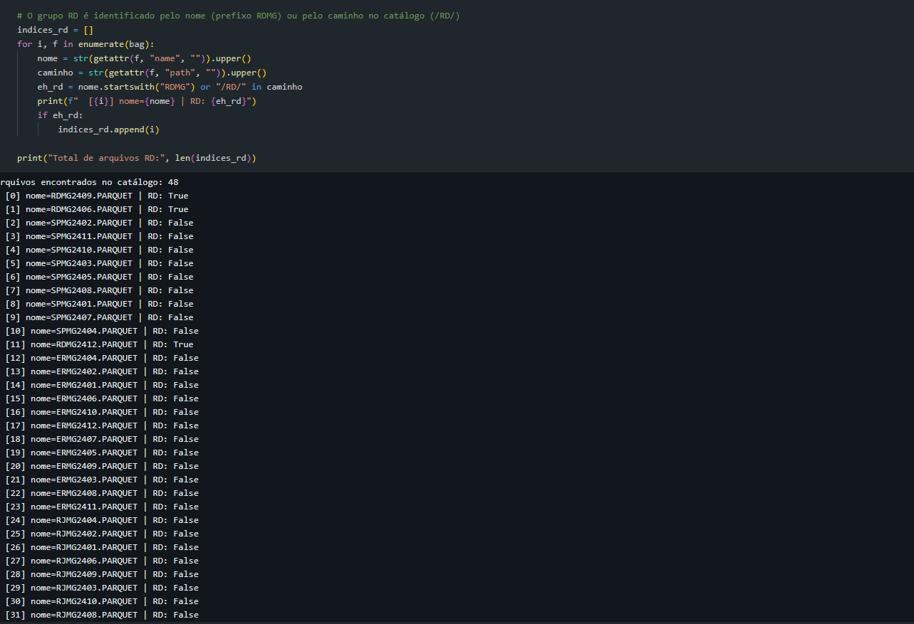
*Inspeção prévia: lista dos arquivos do catálogo com o filtro do grupo RD, confirmando os 12 arquivos RDMG2401 a RDMG2412 e a exclusão dos grupos RJ, ER e SP.*

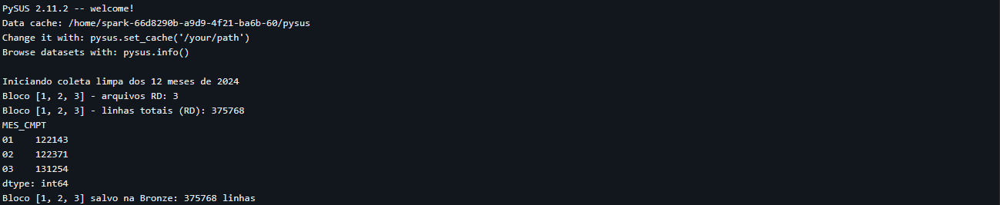
*Loop de coleta: quatro blocos trimestrais salvos na Bronze, com a contagem de linhas de cada bloco e a verificação de volume por mês.*

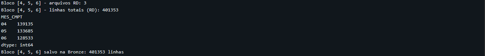
*Validação: 1.558.079 registros brutos nas 12 competências, 239 chaves duplicadas e 0 nulos nas colunas-chave.*

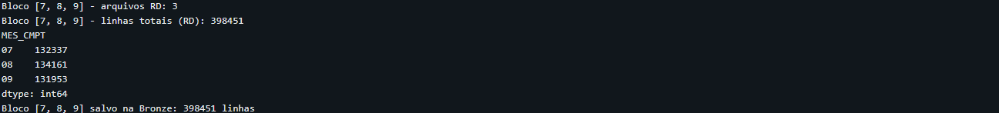
*Pasta sih_rd_mg_2024 no volume dados_mvp, com os arquivos Parquet salvos na nuvem.*

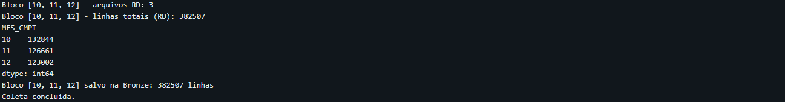
*Arquivos gerados pela gravação em Parquet, evidenciando a persistência da camada.*

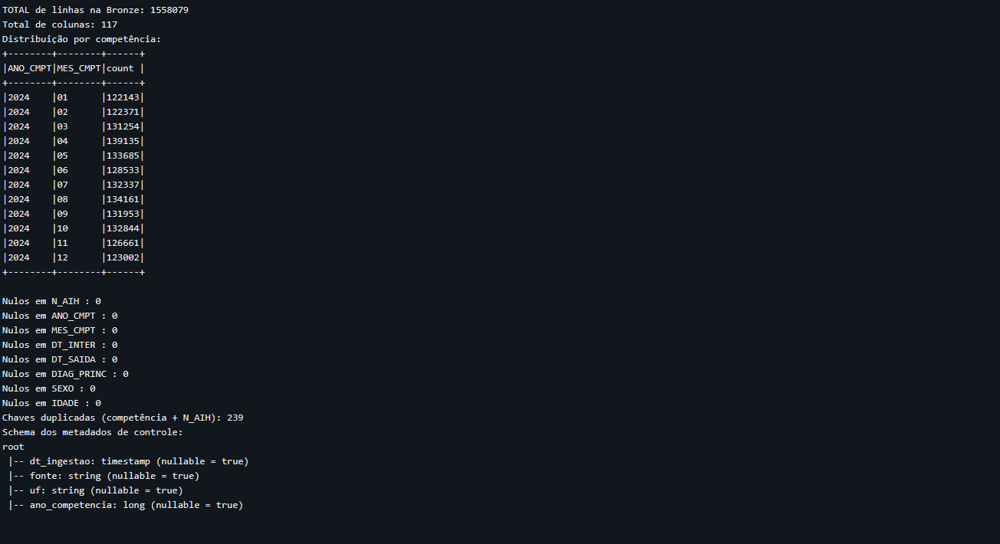
*Colunas de controle adicionadas na ingestão (dt_ingestao, fonte, uf, ano_competencia).*

## Modelagem e Catálogo de Dados (Etapa 4.3)

### O modelo

Adotei o Esquema Estrela, com uma tabela fato central cercada por quatro dimensões. A escolha se justifica porque o dado é um evento (a internação) com atributos categóricos que se repetem muito (tempo, diagnóstico, município, hospital), exatamente o cenário em que o esquema estrela otimiza as consultas analíticas.

As tabelas foram criadas no `03_gold.ipynb` e registradas no Unity Catalog como tabelas gerenciadas, aparecendo no catálogo do Databricks. A documentação das colunas foi aplicada direto no catálogo, com comandos de comentário, então as descrições ficam visíveis no Catalog Explorer.

### Tabelas e colunas

**fato_internacoes** (1.469.265 linhas), uma linha por AIH.

| Coluna | Tipo | Descrição |
|---|---|---|
| sk_tempo | date | Chave da dimensão tempo (data de internação) |
| sk_diagnostico | string | Chave da dimensão diagnóstico (código CID-10) |
| sk_municipio | string | Chave da dimensão município (código IBGE de residência) |
| sk_hospital | string | Chave da dimensão hospital (CNPJ) |
| N_AIH | string | Número da AIH, identificador da internação |
| sexo_desc | string | Sexo do paciente: Masculino, Feminino ou Ignorado |
| idade_anos | int | Idade em anos, convertida pelo PySUS na leitura do arquivo |
| faixa_etaria | string | Faixa etária: 0-4, 5-9, 10-19, 20-29, 30-39, 40-49, 50-59, 60-69, 70-79, 80+ ou Ignorado |
| QT_DIARIAS | int | Quantidade de diárias da internação |
| MARCA_UTI | int | Uso de UTI e tipo: 0 não utilizou, 1 a 5 tipos de UTI |
| indicador_uti | int | Indicador binário de uso de UTI: 1 se houve uso, 0 caso contrário |
| VAL_SH | double | Valor dos serviços hospitalares da AIH |
| VAL_SP | double | Valor dos serviços profissionais da AIH |
| VAL_SADT | double | Valor dos serviços auxiliares de diagnóstico e terapia |
| VAL_TOT | double | Valor total da AIH |
| permanencia_dias | int | Permanência em dias, DT_SAIDA menos DT_INTER |
| indicador_obito | int | Indicador de óbito: 1 se houve óbito, 0 caso contrário |

**dim_tempo** (366 linhas), calendário de 2024, uma linha por dia.

| Coluna | Tipo | Descrição |
|---|---|---|
| sk_tempo | date | Chave da dimensão, igual à data |
| ano | int | Ano da data (2024) |
| mes | int | Mês, de 1 a 12 |
| dia | int | Dia do mês, de 1 a 31 |
| trimestre | int | Trimestre, de 1 a 4 |
| nome_mes | string | Nome do mês em português |
| dia_semana | string | Nome do dia da semana em português |

**dim_diagnostico** (8.026 linhas), um registro por código CID-10.

| Coluna | Tipo | Descrição |
|---|---|---|
| sk_diagnostico | string | Chave da dimensão, igual ao código CID-10 |
| codigo_cid10 | string | Código CID-10 do diagnóstico principal |
| capitulo_cid | string | Capítulo CID derivado da primeira letra do código |

**dim_municipio** (2.291 linhas), municípios de residência dos pacientes.

| Coluna | Tipo | Descrição |
|---|---|---|
| sk_municipio | string | Chave da dimensão, igual ao código IBGE de 7 dígitos |
| codigo_ibge | string | Código IBGE do município de residência |
| uf | string | UF derivada dos dois primeiros dígitos do código IBGE |

**dim_hospital** (389 linhas), estabelecimentos de saúde.

| Coluna | Tipo | Descrição |
|---|---|---|
| sk_hospital | string | Chave da dimensão, igual ao CNPJ do estabelecimento |
| cnpj_hospital | string | CNPJ do estabelecimento (campo CGC_HOSP) |

### Linhagem

Cada tabela da Gold é derivada diretamente da camada Silver, que por sua vez vem da Bronze. As dimensões são extrações distintas da Silver, e a fato carrega as chaves que apontam para elas. As descrições de cada tabela e coluna também foram registradas no Unity Catalog, cobrindo contexto, tipo de dado, domínio de valores e linhagem de cada campo, conforme exigido na etapa 4.3.

### Evidências da modelagem

A verificação do modelo confirmou a contagem das cinco tabelas (dim_tempo, dim_diagnostico, dim_municipio, dim_hospital e fato_internacoes) e a integridade referencial da fato, com todas as linhas conectadas às dimensões, sem registros órfãos.

### Catálogo de Dados (screenshots do sistema de catálogo)

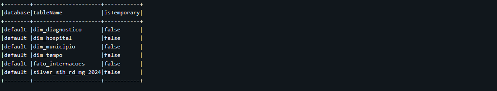
*As cinco tabelas da camada Gold registradas no Unity Catalog, no schema default do workspace.*

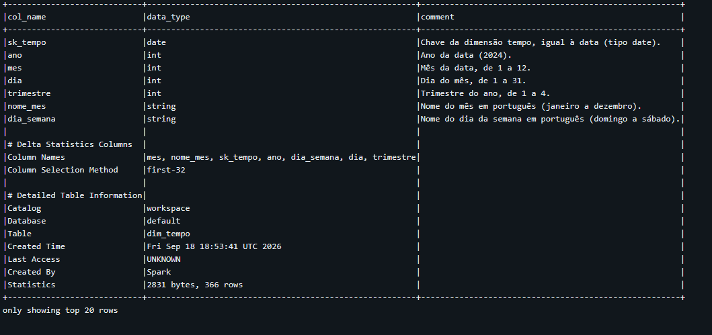
*Estrutura de colunas da dimensão dim_tempo, com tipo de dado e descrição de cada campo preenchidas no catálogo.*

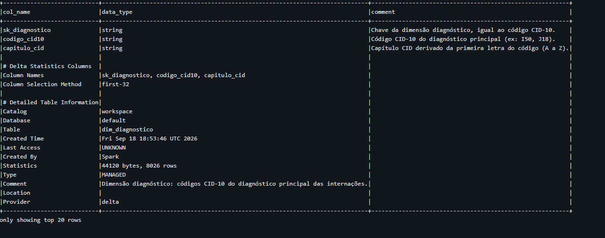
*Estrutura de colunas da dimensão dim_diagnostico, com as descrições de sk_diagnostico, codigo_cid10 e capitulo_cid preenchidas no catálogo.*

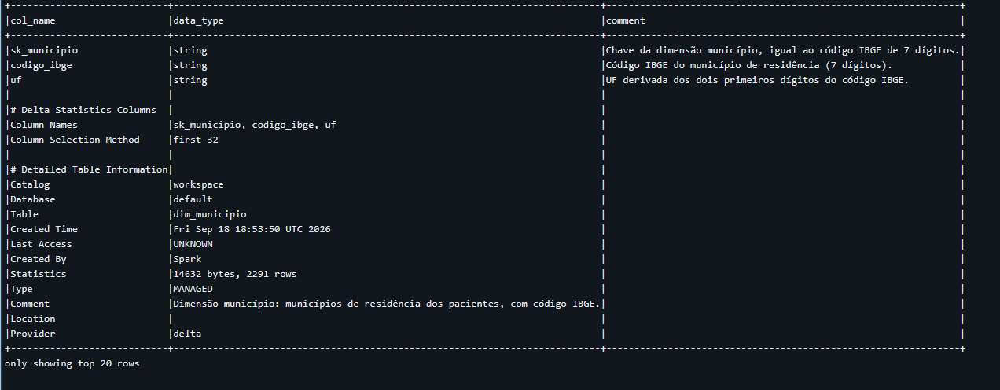
*Estrutura de colunas da dimensão dim_municipio, com as descrições de sk_municipio, codigo_ibge e uf preenchidas no catálogo.*

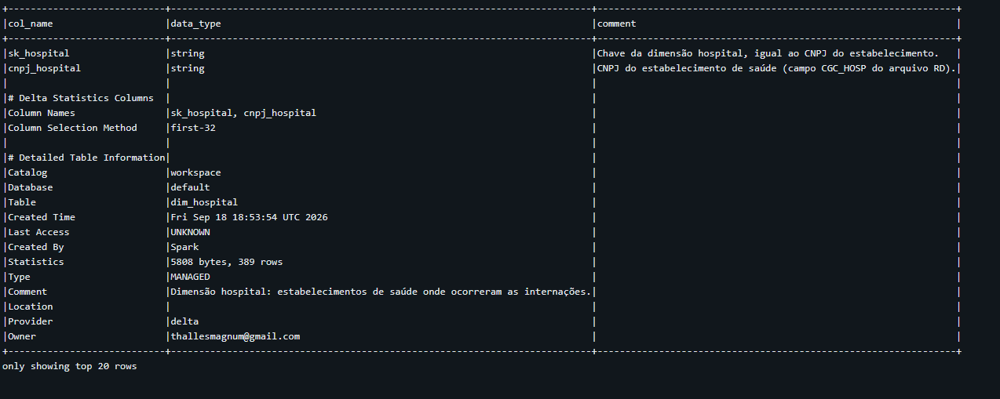
*Estrutura de colunas da dimensão dim_hospital, com as descrições de sk_hospital e cnpj_hospital preenchidas no catálogo.*

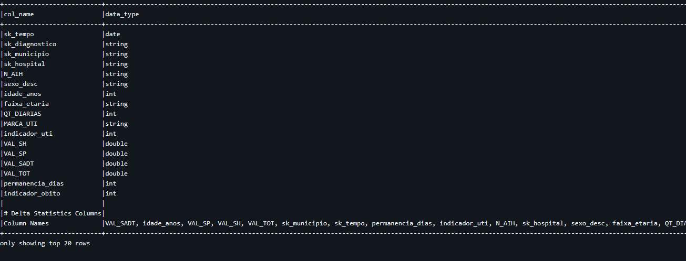
*Estrutura de colunas da tabela fato_internacoes, com tipo de dado e descrição de cada campo preenchidas no catálogo.*

## Pipeline de Dados (Etapa 4.4)

O pipeline segue a Arquitetura Medalhão e foi ramificado em um notebook por camada, para deixar cada responsabilidade isolada e reexecutável de forma independente.

| Camada | Script | Responsabilidade |
|---|---|---|
| Bronze | `01_coleta.ipynb` | Coleta do DATASUS e gravação do dado bruto em Parquet |
| Silver | `02_silver.ipynb` | Limpeza, deduplicação, tipagem e filtro de escopo, gravação em Delta |
| Gold | `03_gold.ipynb` | Modelagem em esquema estrela e registro no catálogo |
| Análise | `04_analise.ipynb` | Qualidade de dados e resposta às perguntas de negócio |

A camada Bronze guarda o dado como veio da fonte, apenas com metadados de controle. A Silver aplica as transformações de limpeza e padronização, gravando em Delta Lake. A Gold monta o modelo dimensional, também em Delta, e registra as tabelas no Unity Catalog. A análise consome as tabelas Gold.

Todas as camadas são persistidas no volume `dados_mvp`, com as pastas `bronze`, `silver` e `gold`. Os scripts estão disponíveis no repositório público deste projeto: [LINK DO REPOSITÓRIO GITHUB].

### Persistência das camadas na nuvem (screenshots)

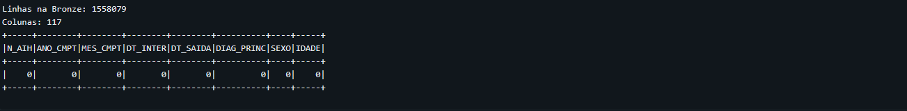
*Leitura da Bronze: 1.558.079 registros, 117 colunas e 0 nulos nas colunas-chave.*

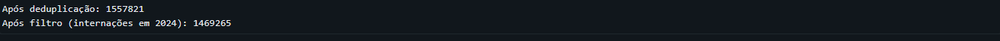
*Transformações: 1.557.821 registros após deduplicação (remoção de 258 linhas) e 1.469.265 após o filtro de internações ocorridas em 2024.*

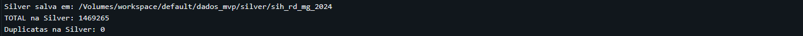
*Checagem de completude após as transformações, confirmando 0 nulos nas colunas-chave da Silver.*

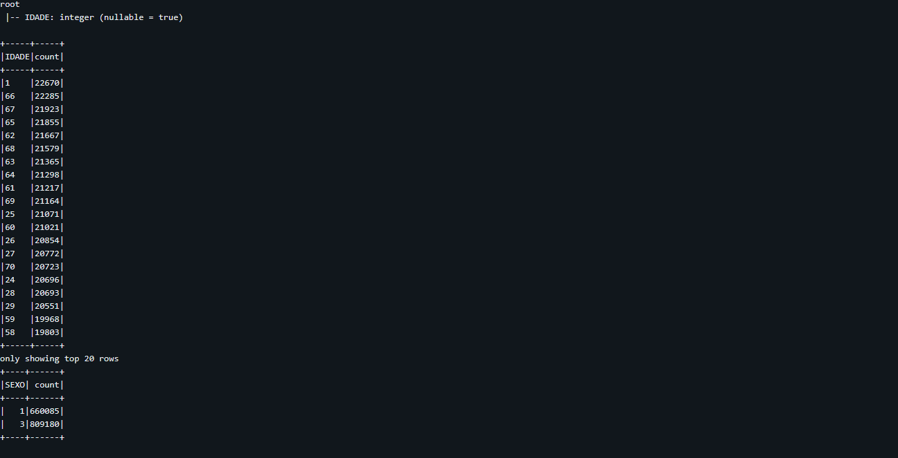
*Gravação da Silver em formato Delta: 1.469.265 registros e 0 chaves duplicadas.*

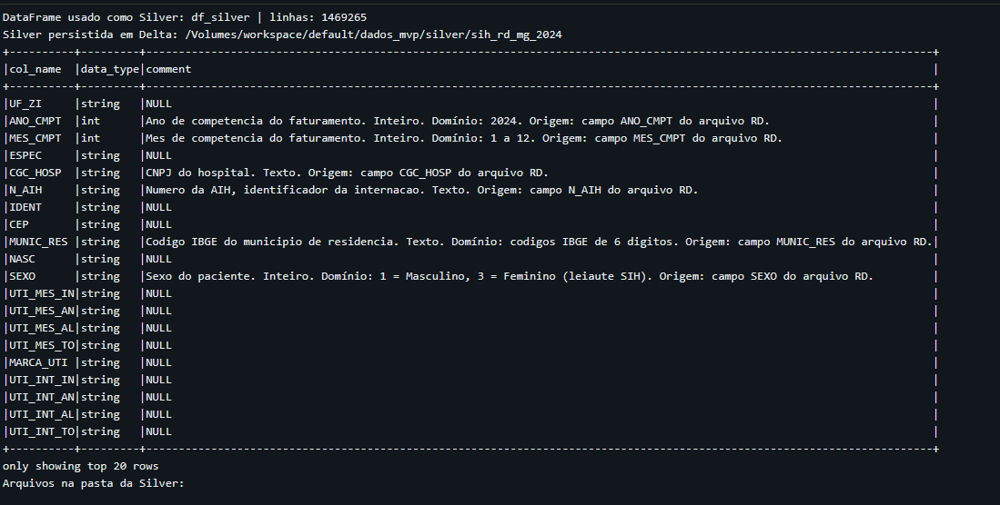
*Tabela Silver persistida no volume, com os metadados e o schema das colunas documentadas no catálogo.*

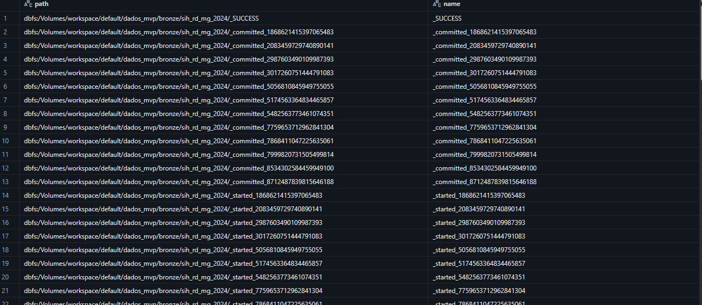
*Pastas bronze, silver e gold no volume dados_mvp, evidenciando a persistência das três camadas na nuvem.*

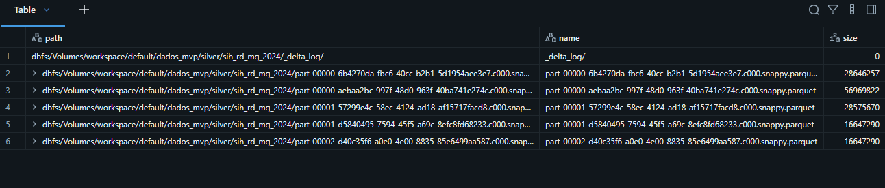
*Visão geral do pipeline de ponta a ponta, da coleta na Bronze até a modelagem na Gold.*

## Qualidade de Dados (Etapa 4.5)

A verificação cobriu completude, consistência e unicidade, na captura (Bronze) e na modelagem (Gold).

**Problema 1: coleta incompleta na primeira execução.** As competências 06, 09 e 12 (junho, setembro e dezembro) não foram baixadas, o que distorcia a sazonalidade e subestimava os custos totais. Correção: adição de verificação de volume por mês dentro de cada bloco de coleta e re-coleta completa, validando as 12 competências na Bronze antes de seguir o pipeline.

**Problema 2: chaves duplicadas na Bronze.** A checagem por competência mais N_AIH encontrou 239 chaves repetidas. O DATASUS reprocessa AIH e o arquivo original traz repetições, comportamento esperado, não erro de coleta. Tratamento: deduplicação pela chave natural na Silver, mantendo a primeira ocorrência, com remoção de 258 linhas (a Bronze passou de 1.558.079 para 1.557.821 registros).

**Problema 3: competência fora do escopo.** A competência 2024 inclui internações ocorridas em anos anteriores (de 2008 a 2023), faturadas em 2024. Tratamento: filtro na Silver, mantendo apenas internações ocorridas entre 1 de janeiro e 31 de dezembro de 2024. A Silver passou de 1.557.821 para 1.469.265 registros, com a remoção de 88.556 internações fora do escopo.

**Problema 4: tipagem.** Datas vinham como texto no formato YYYYMMDD e valores como texto. Tratamento: conversão das datas para o tipo date e dos valores monetários para double na Silver.

**Problema 5: idade 100% ignorada.** A coluna IDADE já chega convertida em anos pelo PySUS, e a decodificação do formato codificado do SIH anulava todas as linhas. Correção: cast direto para inteiro, preservando eventuais não informados como "Ignorado".

**Problema 6: sexo ignorado.** O leiaute do SIH usa 1 = Masculino e 3 = Feminino, diferente do SIM/SINASC, que usam 1 e 2. Correção: mapeamento correto, zerando os ignorados.

**Verificação de completude.** Nas colunas-chave (N_AIH, ANO_CMPT, MES_CMPT, DT_INTER, DT_SAIDA, DIAG_PRINC, SEXO, IDADE), a contagem de nulos foi zero na Bronze e zero na Silver após as transformações. Na Gold, a checagem final confirmou zero valores negativos em VAL_TOT, zero permanências negativas, zero idades negativas, zero sexo ignorado e zero idade ignorada.

**Verificação de integridade.** A checagem de órfãos confirmou que todas as linhas da fato casam com a dimensão diagnóstico.

## Análise de Dados (Etapa 4.5)

### Pergunta 1: perfil por sexo

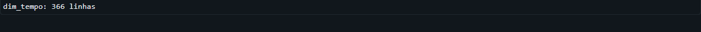

Das 1.469.265 internações, 809.180 são de pacientes do sexo feminino (55,07%) e 660.085 do masculino (44,93%), sem nenhum registro ignorado. A predominância feminina é influenciada pelas internações obstétricas, já que o capítulo de gravidez, parto e puerpério é o mais frequente do conjunto, respondendo por 173.240 internações.

### Pergunta 2: perfil por faixa etária

A faixa de 60 a 69 anos lidera com 215.374 internações (14,66%), seguida de 20 a 29 anos com 197.459 (13,44%) e 50 a 59 anos com 181.309 (12,34%). O peso dos idosos é expressivo: as faixas de 60 anos ou mais somam 521.660 internações (35,5% do total), refletindo o envelhecimento populacional e a maior demanda hospitalar dessa faixa. O grupo de 20 a 29 anos, por sua vez, é fortemente influenciado pelas internações obstétricas.

### Pergunta 3: diagnósticos mais frequentes

O capítulo O (gravidez, parto e puerpério) lidera com 173.240 internações (11,79%), seguido do capítulo I (doenças do aparelho circulatório) com 157.524 (10,72%), J (aparelho respiratório) com 154.829 (10,54%) e K (aparelho digestivo) com 150.350 (10,23%). O código mais frequente é o O800 (parto espontâneo) com 53.840 internações e valor médio de `R$ 628,16`, seguido de J189 (pneumonia não especificada) com 39.501 e A90 (dengue) com 32.688, coerente com o cenário epidemiológico de 2024 em Minas Gerais. Os maiores custos médios estão em I219 (infarto agudo do miocárdio não especificado) com `R$ 6.589,27` e A419 (sepse não especificada) com `R$ 5.243,98`, indicando que as condições críticas concentram os gastos por internação.

### Pergunta 4: sazonalidade

O volume mensal é relativamente estável entre janeiro e outubro, com pico em abril (137.463 internações) e menor volume em dezembro (64.405). O valor de dezembro é esperado no SIH, pois parte do faturamento de dezembro é processada nos arquivos de janeiro do ano seguinte, criando uma defasagem natural entre a data da internação e a competência de pagamento. Na semana, segunda-feira concentra o maior volume (249.809 internações, cerca de 17% do total) e domingo o menor (135.069), padrão típico de redução de procedimentos eletivos no fim de semana. A permanência média cresce ao longo da semana, de 4,39 dias na segunda para 5,17 no sábado, sugerindo que internações iniciadas no fim de semana tendem a ser mais longas.

### Pergunta 5: permanência

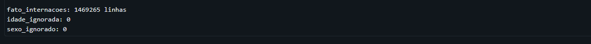

A permanência média geral é de 4,7 dias, com mediana de 2 dias e máximo de 351 dias. Os diagnósticos com maior permanência média são Z50 (cuidados envolvendo reabilitação) com 102,55 dias, G319 (doenças degenerativas do sistema nervoso) com 55,24 dias e G328 (outras síndromes degenerativas especificadas) com 38,23 dias. Esses casos refletem internações de longa duração ligadas a reabilitação e doenças neurodegenerativas, que demandam cuidados contínuos e alta complexidade assistencial, com impacto direto na ocupação de leitos.

### Pergunta 6: custos

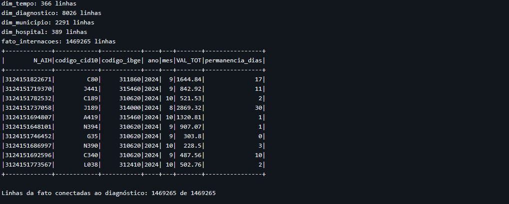

O valor total das internações é de `R$ 2.666.026.836,37`, com valor médio de `R$ 1.814,53` por AIH. Os meses de julho e agosto concentram os maiores valores totais (cerca de `R$ 251,7 milhões` cada), e setembro tem o maior valor médio mensal (`R$ 1.939,79`). O mesmo output também traz a distribuição por município, discutida na pergunta 7.

### Pergunta 7: municípios de residência

Belo Horizonte (310620) concentra o maior volume, com 147.399 internações e `R$ 304,19 milhões`, seguido de Uberlândia (317020) com 55.147 internações e `R$ 92,10 milhões`, Juiz de Fora (313670) com 36.788 e `R$ 92,29 milhões`, e Contagem (311860) com 30.950 e `R$ 67,82 milhões`. A lista é completada por Montes Claros (314330), Governador Valadares (312770), Betim (310670), Uberaba (317010), Ribeirão das Neves (315460) e Ipatinga (313130), todos polos regionais de saúde, confirmando a concentração da assistência hospitalar de média e alta complexidade nos grandes centros urbanos do estado.

### Complemento: mortalidade e UTI

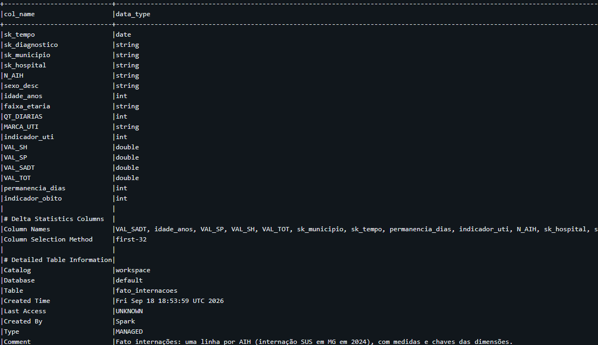

A taxa de mortalidade hospitalar geral é de 4,59%, com 67.468 óbitos em 1.469.265 internações. Os diagnósticos mais letais são I469 (parada cardíaca não especificada) com 74,70% de mortalidade, R570 (choque cardiogênico) com 68,29% e R579 (choque não especificado) com 57,41%. A sepse aparece em destaque: A419 (sepse não especificada) responde por 16.671 internações e 6.934 óbitos, com taxa de 41,59%, e A418 (outras septicemias) com 42,46%, evidenciando a gravidade das infecções generalizadas no ambiente hospitalar.

Sobre a UTI, 164.994 internações (11,23%) utilizaram UTI. O valor médio das internações com UTI é de `R$ 7.944,61`, contra `R$ 1.039,06` sem UTI, ou seja, a internação com UTI custa em média 7,6 vezes mais. Esse diferencial reflete a alta densidade tecnológica e de cuidados intensivos, e mostra que a UTI é o principal vetor de custo das internações de alta complexidade.

### Discussão geral

O conjunto dos resultados revela um sistema hospitalar concentrado e de alto custo assistencial. A demanda é puxada por partos, doenças circulatórias e respiratórias, com peso relevante dos idosos, e o gasto é fortemente influenciado pelas internações críticas, especialmente as que passam por UTI e as que evoluem para sepse. A concentração geográfica em Belo Horizonte e nos polos regionais indica que o planejamento de leitos e recursos deve considerar a rede de referência estadual, enquanto a sazonalidade semanal aponta para a necessidade de dimensionar equipes e leitos eletivos fora dos fins de semana.

## Autoavaliação

Consegui atingir o objetivo principal do trabalho, que era construir um pipeline de dados de ponta a ponta na nuvem capaz de responder às perguntas de negócio. Todas as 7 perguntas e o complemento foram respondidos com base na coleta completa das 12 competências de 2024, e o pipeline cobre as etapas de coleta, modelagem, carga, qualidade e análise exigidas no MVP.

As principais dificuldades apareceram na execução. A primeira coleta ficou incompleta, deixando de fora as competências de junho, setembro e dezembro, o que distorceu a sazonalidade e subestimou os custos; a correção exigiu adicionar verificação de volume por mês e reexecutar o pipeline inteiro. A biblioteca PySUS mudou de API entre versões, o que quebrou o código de coleta e exigiu adaptação para a versão 2.x. A decodificação de idade e sexo seguiu inicialmente o leiaute errado, deixando 100% das idades e metade dos sexos como ignorados, corrigido após consultar o leiaute oficial do SIH (sexo feminino é 3, e a idade já vem em anos). Também enfrentei o limite de tamanho de relação local do Spark, contornado com gravação em blocos, e um conflito de schema Delta ao registrar a tabela fato no catálogo, resolvido com a remoção da tabela antiga antes do novo registro.

Como trabalhos futuros, seria possível ampliar a análise para outros estados e anos, permitindo comparações regionais e temporais; incorporar os arquivos SP (serviços profissionais) do SIH para detalhar a composição dos custos; cruzar com dados populacionais do IBGE para calcular taxas por habitante; enriquecer a dimensão hospital com dados do CNES; e publicar um dashboard interativo conectado à camada Gold para monitoramento contínuo dos indicadores hospitalares.

## Referências

- DATASUS, Sistema de Informações Hospitalares (SIH/SUS): https://datasus.saude.gov.br/acesso-a-informacao/morbidade-hospitalar-do-sus-sih-sus/
- PySUS, biblioteca para acesso aos dados do DATASUS: https://pysus.readthedocs.io/
- IBGE, códigos de municípios: https://www.ibge.gov.br/
- Databricks, documentação oficial (Lakehouse, Delta Lake e Unity Catalog): https://docs.databricks.com/